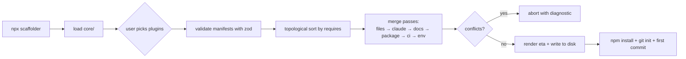
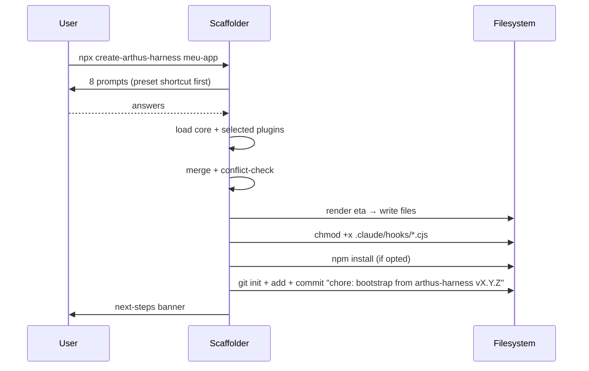
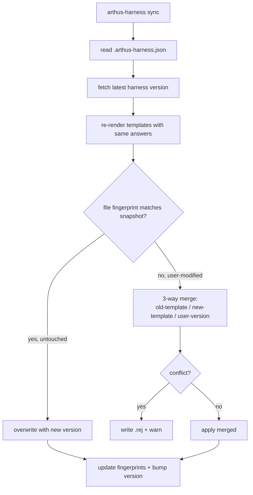

# Analysis 03 — Architecture design

> Source: `Plan` agent (Opus 4.7) · 2026-05-08

---

# arthus-harness — Architecture

> Generic Claude Code engineering kit extracted from `go-party-venue-hub`. Solo-dev oriented, opinionated core, opt-in plugins.

## 1. Folder structure

`arthus-harness` is a **monorepo with one published npm package** plus a `templates/` tree the package reads at runtime. Single source of truth, no duplication between scaffolder and contents.

```
arthus-harness/
├── package.json                  # npm package: "create-arthus-harness"
├── bin/
│   └── create.mjs                # entry: npx create-arthus-harness <nome>
├── src/                          # scaffolder code (TypeScript, compiled to dist/)
│   ├── prompts.ts                # interactive prompts (prompts/inquirer)
│   ├── render.ts                 # template engine (eta — see §3)
│   ├── plugin-loader.ts          # discovery + manifest validation (zod)
│   ├── conflict-resolver.ts      # §2
│   ├── git.ts                    # init + first commit
│   ├── post-install.ts           # run npm install, git init, hooks chmod
│   └── sync.ts                   # arthus-harness sync (re-template, §6)
├── core/                         # ALWAYS shipped — opinionated baseline
│   ├── .claude/
│   │   ├── settings.json.eta     # placeholders: {{projectSlug}}
│   │   ├── agents/               # 17 agents from go-party (.md)
│   │   ├── skills/               # 12 skills (incl. experience-principles)
│   │   ├── commands/             # 7 slash commands
│   │   ├── hooks/                # 4 .cjs hooks (pre/post/stop)
│   │   └── templates/            # ADR/SPEC/RUNBOOK/etc — 8 doc skeletons
│   ├── Docs/
│   │   ├── state.md.eta          # hot snapshot skeleton
│   │   ├── arquitetura/arquitetura-tecnica.md.eta
│   │   ├── design-system/        # DESIGN.md skeleton + tokens stub
│   │   └── produto/
│   │       ├── PRODUTO.md.eta
│   │       ├── requirements.md.eta
│   │       ├── jornadas/.gitkeep
│   │       └── principios-de-experiencia/   # see §7
│   │           ├── strategy-A.literal.md     # 4 sensações + 5 réguas
│   │           └── strategy-C.framework.md   # framework, project fills
│   ├── MISSION.md.eta            # technical invariants skeleton
│   ├── CLAUDE.md.eta             # operational manual, points to docs above
│   ├── AGENTS.md.eta             # short brief
│   └── .gitignore
├── plugins/                      # OPT-IN — user picks at scaffold time
│   ├── supabase/
│   │   ├── plugin.yaml
│   │   ├── files/                # supabase/migrations/, client.ts, etc
│   │   ├── claude/               # supabase-rls-pattern, supabase-migration skills
│   │   ├── docs/                 # arquitetura/supabase.md
│   │   └── package-fragments.json # scripts: db:reset, supabase:gen-types
│   ├── design-system-pipeline/   # design:sync + design:check + DESIGN.md → CSS
│   ├── payment-asaas/
│   ├── i18n/
│   └── e2e-playwright/           # storageState pattern, playwright.config
├── presets/                      # named bundles of plugins
│   ├── goparty-like.yaml         # supabase + design-system + asaas + i18n + e2e
│   └── minimal.yaml              # core only
├── docs/                         # arthus-harness's own docs
│   ├── README.md
│   ├── plugin-authoring.md
│   └── upgrade-guide.md
└── tests/
    ├── snapshots/                # generated project snapshots per preset
    └── fixtures/
```

**Why this shape.** `core/` is treated like a giant template directory; `plugins/` are self-describing add-ons; `src/` is a thin orchestrator that copies + renders. No code duplication, single npm install, easy to clone-and-hack.

---

## 2. Core ↔ plugin contract

**Manifest: `plugin.yaml`** (not `package.json` — plugins are not npm packages, they're folders inside this repo; YAML is human-friendly and supports comments).

```yaml
name: supabase
version: 0.3.0
description: Supabase (Postgres + Auth + Storage + Edge Functions)
requires:
  core: ">=0.3"
  plugins: []                     # e.g. ["i18n"] for hard deps
conflicts: []                     # plugins that cannot coexist
contributes:
  files:                          # copied with eta rendering
    - from: files/**
      to: ./
  claude:
    skills: [supabase-rls-pattern, supabase-migration]
    agents: [database-architect, database-reviewer]   # only added if not in core
    hooks: []
    commands: []
  docs:
    - from: docs/arquitetura/supabase.md
      to: Docs/arquitetura/supabase.md
  package:
    scripts:
      db:reset: "supabase db reset"
      supabase:gen-types: "supabase gen types typescript ..."
    deps:
      "@supabase/supabase-js": "^2.45.0"
    devDeps:
      "supabase": "^1.200.0"
  ci:
    jobs:
      - name: supabase-check
        run: "npm run db:lint"
  env:                            # appended to .env.example
    - VITE_SUPABASE_URL
    - VITE_SUPABASE_ANON_KEY
prompts:                          # plugin-specific prompts
  - name: supabaseProjectRef
    message: "Supabase project ref (or skip)"
    type: input
    optional: true
```

**What a plugin can contribute.** Files (rendered), Claude assets (skills/agents/hooks/commands), Docs/ pages, `package.json` fragments (scripts, deps, devDeps), CI jobs, `.env.example` keys, additional interactive prompts.

**Conflict resolution.** Three categories:

| Conflict | Strategy |
|---|---|
| Same `package.json` script name (`db:reset` from two plugins) | **Hard error at scaffold time**, list offending plugins, abort. |
| Same file path (`src/lib/supabase.ts`) | Hard error. Plugins must namespace under `src/integrations/<plugin>/`. |
| Same Claude skill/agent name | First plugin wins (deterministic by load order from preset); warn. |
| `package.json` deps version mismatch | Pick higher semver, warn. |



---

## 3. `npx create-arthus-harness <nome>` flow

**Templating engine: [eta](https://eta.js.org).** Reasoning: Mustache is too logic-less (can't do `{{#if hasSupabase}}`); Handlebars is heavyweight; eta is 4kb, supports JS expressions, EJS-style syntax (`<%= var %>` / `<% if %>`), and is actively maintained. We avoid `{{var}}` because it collides with Vue/Angular templates the user might paste in.

**Prompts (8 questions, 30 seconds total):**

1. `projectName` (default: dir name, slugified)
2. `description` (one-line)
3. `stack` — single select: `react-vite-ts` (default), `next-app-router`, `none`
4. `plugins` — multi-select: `supabase`, `design-system-pipeline`, `payment-asaas`, `i18n`, `e2e-playwright`
5. `preset` shortcut — quick-pick `goparty-like` / `minimal` / `custom` (overrides 3+4)
6. `experiencePrinciples` — `strategy-A` (literal 4 sensações default) / `strategy-C` (framework, you fill)
7. `gitInit` — boolean, default true
8. `installDeps` — boolean, default true



**Generated structure** mirrors `go-party-venue-hub`'s top-level: `CLAUDE.md`, `MISSION.md`, `AGENTS.md`, `Docs/`, `.claude/`, plus stack files from chosen plugins. `.arthus-harness.json` (lockfile, see §6) is dropped at root.

---

## 4. Skill `init-project` (in-Claude-Code)

**Recommendation: the skill INVOKES the npx scaffolder, doesn't duplicate logic.**

The skill is a thin wrapper that:
1. Asks the user (via Claude conversation) the same 8 questions in natural language.
2. Builds the equivalent `npx create-arthus-harness <name> --preset=... --plugins=... --principles=A --no-prompt` command.
3. Runs it via Bash.
4. Reports back, optionally opens `Docs/state.md` for the user to start filling.

**When to pick the skill over npx:** when the user is *already inside Claude Code in an empty/new project directory* and wants to bootstrap without leaving the conversation. The npx route is for cold-start from terminal before opening Claude Code at all.

**Why invoke, not duplicate:**

| Pro (invoke) | Con (invoke) |
|---|---|
| One source of truth — bug fix in scaffolder helps both paths | Requires Node + npx available (always true on dev machines) |
| Skill stays ~50 lines | Slightly slower (npx download once, then cached) |
| Versioning aligned automatically | — |

Duplicating logic in markdown skill instructions would mean two truths drifting — exactly the anti-pattern the harness exists to prevent.

---

## 5. Distribution model

**Recommendation: (a) npm package as primary, (b) GitHub repo as the *source* for `npm publish` and a clone-friendly fallback. Not "both" as parallel channels — one canonical, the other a mirror.**

| Option | Pros | Cons |
|---|---|---|
| npm only | One-line install, semver, `npx` works without auth | Hidden source for spelunking |
| GitHub template only | Clone-and-hack obvious | No `npx`, manual version pin, slower |
| **npm + GitHub source** | npm for users, GitHub for inspection, issues, PRs | Slight publish overhead |

**Concrete:** publish `create-arthus-harness` (matches npm convention so `npx create-arthus-harness x` works without scope hassle). Repo `github.com/cristianorj22/arthus-harness` is public; tags = npm versions; releases auto-published via GH Actions on tag.

Solo dev rationale: npm gives you `npx` + `npm view create-arthus-harness versions` + `--latest` discoverability for free. GH template repos require the user to use the GH UI, which is friction.

---

## 6. Versioning + sync strategy

**Recommendation: generator-style with a snapshot lockfile.** Hybrid of "lock-in" + "regenerate-on-demand". Solo-dev pragma.

**Mechanism:** at scaffold time, write `.arthus-harness.json` to project root:

```json
{
  "version": "0.3.0",
  "preset": "goparty-like",
  "plugins": ["supabase", "design-system-pipeline", "payment-asaas", "i18n", "e2e-playwright"],
  "principles": "A",
  "answers": { "projectName": "meu-app", "...": "..." },
  "fingerprint": {
    ".claude/hooks/config-protection.cjs": "sha256:abc123...",
    "MISSION.md": "sha256:def456..."
  }
}
```

**Sync command:** `npx arthus-harness sync` (alias `arthus sync` if installed locally).



**Why this beats alternatives for solo dev:**

- **Lock-in (snapshot, no sync):** wastes the harness's continued evolution.
- **Forkable:** every project becomes a fork; merging upstream is git-rebase hell.
- **Submodule/subtree:** `.claude/` becomes read-only submodule — kills the "edit a hook in this project" workflow.
- **Generator + fingerprint:** files Cristiano never touched get auto-updated; ones he edited get a 3-way merge. Lightweight, no submodule dance, opt-in (he runs `sync` only when he wants).

---

## 7. 3 layers of protection — how they ship

### Process layer (hooks + commands)

Ships in `core/.claude/hooks/`. Categorized:

| Hook | Mode | Reason |
|---|---|---|
| `config-protection.cjs` | **Bloqueante** (PreToolUse, exit 2) | Generic — protects `tsconfig`, `eslint.config`, `package.json`, `.claude/settings.json`, `MISSION.md`. Universal. |
| `batch-format-typecheck.cjs` | **Bloqueante** (Stop) | Runs `npm run check:all` (whatever scripts plugins added). If a project has no `type-check`, it no-ops gracefully. |
| `post-edit-accumulator.cjs` | **Warning** (PostToolUse) | Auto-memory in `~/.claude/projects/<slug>/memory/` — never blocks. |
| `journey-touch-reminder.cjs` | **Warning** (PostToolUse) | Reminds when UI edits don't touch journey doc. Off by default if no `Docs/produto/jornadas/` exists. |
| `design-quality-check.cjs` | **Plugin** (`design-system-pipeline`) | Only ships if plugin selected — runs `design:check` on edits. |

**Slash commands** (7) all ship in core: `/plan`, `/feature-dev`, `/code-review`, `/review-pr`, `/refactor-clean`, `/save-session`, `/init-project`. The Doc-specific ones (`/design-check`, `/prp-plan`, `/prp-prd`) ship as core, but no-op gracefully if their target docs don't exist.

### Technical invariants — `MISSION.md`

Ships as **template with concrete skeleton, vague specifics**:

```markdown
# MISSION.md — invariantes técnicas não-negociáveis

## §1 Segurança
- Secrets nunca no client. {{projectSlug}}-specific list of secret env vars: TODO
- RLS habilitada em todas as tabelas com user data: TODO se aplicável (plugin supabase auto-fills)

## §2 Idempotência
- Operações financeiras / side-effects externos: idempotency key obrigatória.
- TODO: lista os endpoints/handlers a aplicar.

## §3 Isolamento RBAC
- TODO: papéis e separação.

## §4 Migrations
- Forward-only. Reversibilidade testada em staging.

## §5 [Project-specific]
TODO
```

**Plugin auto-fill:** `supabase` plugin auto-populates §1 and §4 with concrete RLS/migration rules; `payment-asaas` auto-fills §2 with idempotency endpoints. The user inherits a 70%-filled MISSION.md instead of staring at a blank page.

### Experience invariants — `principios-de-experiencia.md`

**At scaffold time the user picks Strategy A or C** (prompt 6, default A). Choice writes a different file.

- **Strategy A (default, literal):** ships `principios-de-experiencia.md` with the literal GoParty 4 sensações (Confiança, Alívio, Clareza, Comemoração) + 5 réguas. Users who don't care about this layer get a sane, opinionated default that *works* — they can swap text later. Justification: most solo-dev projects never write this doc. A pre-filled doc gets *some* enforcement; an empty doc gets none.

- **Strategy C (opt-in, framework):** ships `principios-de-experiencia.md` as a **framework template**: "Define your N sensações-âncora here. Define your M réguas here. The skill `experience-principles` will read this file and enforce whatever you write." File ships with empty-but-typed sections, examples in HTML comments, and the same skill (which reads the file dynamically rather than knowing GoParty hardcoded values).

The skill `experience-principles` ships in core but is **content-agnostic**: it reads `Docs/produto/principios-de-experiencia.md` and applies whatever réguas it finds. No hardcoded GoParty knowledge.

---

## Decisions table

| Area | Decision | Rationale |
|---|---|---|
| 1. Folder structure | Monorepo: `src/` scaffolder + `core/` + `plugins/` + `presets/` in one npm package | Single source of truth; no duplicated content between scaffolder and templates |
| 2. Plugin contract | `plugin.yaml` (zod-validated) declaring files/claude/docs/package/ci/env/prompts | YAML > package.json field for human-edited manifests; explicit contribution surfaces |
| 3. Scaffolder | `npx create-arthus-harness`, eta templating, 8 prompts, optional preset shortcut, git+npm auto-init | eta supports conditionals without weight; one-shot UX |
| 4. Skill init-project | Wraps and invokes the npx scaffolder with `--no-prompt` flags | Avoid duplicate truth; bug fixes propagate to both paths |
| 5. Distribution | npm primary (`create-arthus-harness`), GitHub as canonical source mirror | `npx` UX + GH inspection, no parallel-channel drift |
| 6. Versioning | Generator-style with `.arthus-harness.json` snapshot + `arthus-harness sync` 3-way merge | Lightweight, opt-in updates, preserves user mods |
| 7a. Hooks | `config-protection` + `batch-format-typecheck` bloqueantes; others warnings; design-check plugin-only | Universal hooks block; project-specific ones warn |
| 7b. MISSION | Skeleton with sections + plugin auto-fill | 70%-full beats blank page |
| 7c. Principles | Strategy A literal default; Strategy C framework opt-in; skill is content-agnostic | Opinionated default, escape hatch for projects with different brand |

---

## Open questions for Cristiano

1. **Scope of `core` agents** — all 17 ship by default, or do we move stack-specific ones (e.g. `mobile-developer`, `seo-specialist`) into plugins and ship a leaner core (~10 agents)? My instinct: ship all 17 in core; agents are markdown, near-zero cost.

2. **Memory location.** Current hook writes to `~/.claude/projects/<slug>/memory/`. Slug is derived how — from `projectName` answer, or from `cwd`? Affects multi-machine portability and whether memory survives `git clone` on a different box.

3. **MCP integrations** (`code-review-graph`, `supabase` MCP) — do these get installed/configured by the harness, or stay user-level config? If harness configures them, we need a `~/.claude/settings.json` patcher (touchy — global state).

4. **`arthus-harness sync` UX on conflicts** — interactive prompt per conflict, or write `.rej` files and let the user diff manually? Solo-dev probably prefers the latter (non-blocking), but interactive is friendlier first time.

5. **First plugin to extract — order of work.** Suggest: `design-system-pipeline` first (most isolated, validates the plugin contract), then `supabase` (most complex, validates conflict resolution), then `e2e-playwright`, `i18n`, `payment-asaas`. Confirm sequencing?
