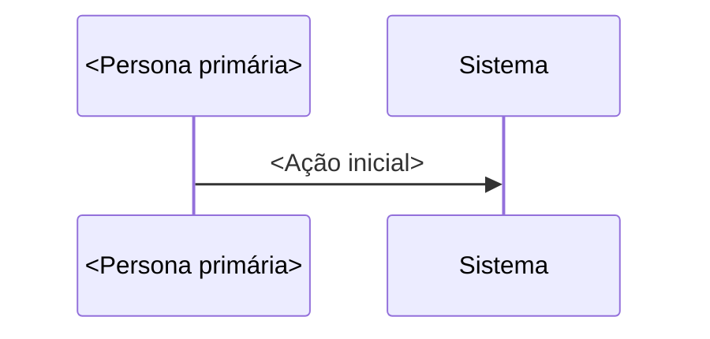

# Jornada: <Nome humano da jornada>

## Por que esta jornada existe?

<1 parágrafo. Se você não consegue escrever em 1 parágrafo por que ela existe, ela não deve existir. Anti-doc-de-cerimônia: este campo é o gate. Foco emocional + régua chave alinhada com `principios-de-experiencia`.>

## Diagrama (swimlane)

## Steps detalhados

<!-- Tabela canônica. Cada linha é 1 step do flow. Ator: quem age. Sensação: 1 das sensações-âncora. RF/RN: referência cruzada com requirements.md. A11y critical: mecanismo ARIA específico. -->

| # | Ator | Step | Sensação | Estado | RF/RN | A11y critical | SLA |
|---|---|---|---|---|---|---|---|
| 1 | <ator> | <descrição do passo> | <sensação> | <UI / DB / API / externo> | RF-XX.YY | <mecanismo ARIA> | <tempo alvo> |

## A11y critical announcements

Eventos que precisam virar `aria-live`. **Coluna "Mecanismo ARIA" é obrigatória** — especificar `role=` ou `aria-live=`. **Não basta texto da mensagem.**

| Evento | Mecanismo ARIA | Prioridade | Dwell time mínimo |
|---|---|---|---|
| <evento dinâmico de status> | `role="status" aria-live="polite"` | Polite | <tempo> |
| <evento de erro bloqueante> | `role="alert"` | Assertive | persistente |
| <operação assíncrona em curso> | `aria-busy="true"` | — | até completar |

## Focus management map

Pra cada transição, **onde o foco vai**.

> **Nota**: regra geral é mover foco pra `<h2>` do novo step (não primeiro input — barulhento pra screen reader anunciar label+value+role+position de uma vez). **Exceção**: step 1 de wizard pode focar primeiro `<input>` porque é início do form (sem contexto ainda).

| De | Para | Foco vai pra |
|---|---|---|
| <gatilho> | <destino> | <elemento que recebe foco> |

## Multi-modal alternatives

Pra cada input visual, alternativa não-visual.

| Input visual | Alternativa |
|---|---|
| <imagem com info> | `alt` descritivo + `<code>` adjacente com info textual |
| Spinner | `` + `aria-busy="true"` |
| Animação | `useReducedMotion()` gate; texto sempre visível |

## Recovery a11y

| Cenário de erro | Tempo mínimo de visibilidade | Foco volta pra | Anúncio (mecanismo ARIA explícito) |
|---|---|---|---|
| <validação inline não-bloqueante> | persistente até correção | campo errado | `aria-live="polite"` + texto orientado a ação |
| <erro bloqueante com modal interativo> | persistente | botão de ação primária no modal | `role="alertdialog" aria-modal="true"` |
| <evento crítico fora de modal> | persistente | botão recovery | `role="alert"` |
| <falha catastrófica> | persistente | link suporte | `role="alert"` + instrução acionável |

## Edge cases + sad paths

- **<cenário 1>**: <descrição + comportamento esperado>.
- **<cenário 2>**: <descrição + recovery path>.
- **<race condition se aplicável>**: <como o código defende>.

## Falha catastrófica

- **<dependência externa> down**: <UI fallback + comportamento>.
- **<webhook async não chega>**: <reconciliação ou recovery manual>.
- **Backend principal down**: app inteiro inacessível — fora do escopo desta jornada.

## Reentrada

- **User volta dias depois**: <estado preservado? rascunho? listagem em qual rota?>
- **User abandona meio-flow**: <auto-save? localStorage? perde tudo?>

## Multi-device handoff

- **Mobile → desktop**: <login persiste? estado sincroniza? gap conhecido?>

## Métricas a observar

- <métrica de funil — taxa de drop por step>
- <métrica de tempo — duração média + p95>
- <métrica de erro — taxa de cenário sad path>
- <métrica de SLA — operação async dentro de target>

## Cross-links

- **Código**: <paths reais — devem existir>
- **Specs**: RF-XX.YY em [`requirements.md`](../requirements.md)
- **Princípios**: Régua N de [`principios-de-experiencia`](../principios-de-experiencia)
- **Diagrama técnico**: [`<flow>.mmd`](../../arquitetura/diagrams/) — view do sistema (this jornada = view do user)
- **Jornadas adjacentes**: `<arquivo.md>` ou `(backlog)`
- **Personas**: definidas em [`../PRODUTO.md`](../PRODUTO.md)

## Backlog identificado nesta jornada

<lista de gaps reais descobertos durante construção da jornada — vira input direto pro roadmap>

1. <gap 1>
2. <gap 2>
